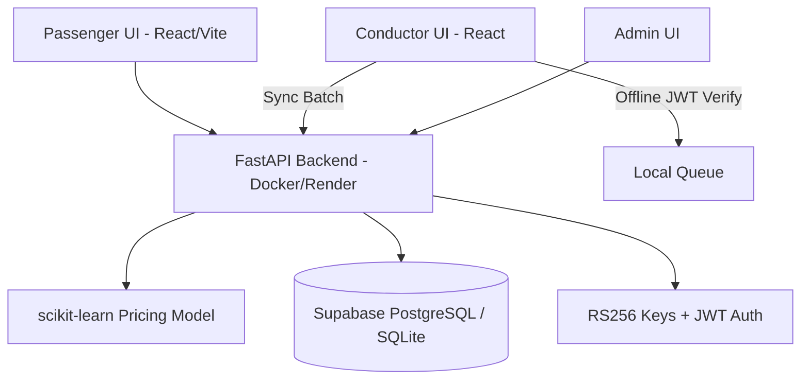

# CodeAlpha_BusPassSystem — Veypass | CodeAlpha Cloud Computing Internship, Task 3

Veypass is a cloud-native, AI-powered, offline-verifiable bus pass booking platform.

## 📋 CodeAlpha Task 3 Requirements Compliance

| # | Official Requirement | How it is implemented | File Reference |
|---|---|---|---|
| 1 | Online ticket booking system hosted on the cloud | Monorepo structured for free tier deploy (Vercel + Render + Supabase). | `render.yaml`, `vercel.json` |
| 2 | Prevent ticket loss, theft and incorrect pricing | 1. Hash-chain tickets for integrity. 2. RS256 signed QR for one-time use. 3. AI pricing server-side only. | `backend/main.py`, `backend/auth.py`, `backend/pricing.py` |
| 3 | Handle high traffic by dynamically provisioning servers | Stateless FastAPI Dockerized API, `/health` endpoint tracks rolling request rate to simulate scale. Dashboard Traffic Spike simulator. | `backend/Dockerfile`, `backend/main.py`, `frontend/src/pages/AdminDashboard.jsx` |
| 4 | Scalability and reliability improvements | 5-minute Ghost Seat soft-locks preventing double-booking; Offline-first conductor QR validation. | `backend/main.py` (hold logic), `frontend/src/pages/ConductorScanner.jsx` |
| 5 | Test and deploy for seamless experience | `loadtest.py` for Locust 200-user load testing; `test_api.py` for Pytest validation. | `backend/loadtest.py`, `backend/test_api.py` |

## 🧠 Core Innovations

1. **Hash-Chain Tickets:** Every ticket is cryptographically linked to the previous one using SHA-256. Altering one breaks the chain.
2. **Offline QR Verification:** Tickets contain a JWT signed with RS256. Conductors verify signatures client-side, zero internet required.
3. **Ghost Seat Protection:** Seat holds create a 5-minute concurrency lock, preventing race conditions under high traffic.
4. **AI Dynamic Pricing:** scikit-learn model predicts demand based on route, hour, and occupancy to adjust fares automatically.
5. **Cloud Elasticity Demo:** Live traffic spike simulator plotting instance auto-scaling based on simulated load metrics.

## 🏗 Architecture



## 🚀 Setup & Run Locally (Zero Setup)

1. **Clone the Repo:**
   ```bash
   git clone <repo_url>
   cd CodeAlpha_BusPassSystem
   ```

2. **Backend (Python 3.10+):**
   ```bash
   cd backend
   python -m venv venv
   source venv/bin/activate  # or .\venv\Scripts\activate on Windows
   pip install -r requirements.txt
   
   # Run the seed script to generate models & data
   python seed.py
   
   # Start the API
   uvicorn main:app --host 0.0.0.0 --port 10000 --reload
   ```

3. **Frontend (Node 18+):**
   ```bash
   cd frontend
   npm install
   npm run dev
   ```

## 🌐 Free Cloud Deployment Guide

1. **Database (Supabase):**
   - Create a free project on Supabase.
   - Get the Postgres Connection String.

2. **Backend (Render):**
   - Connect your GitHub repo to Render.
   - Create a new "Web Service", select `Dockerfile` environment.
   - Add `DATABASE_URL` as an Environment Variable.
   - Render handles scaling horizontally if you upgrade, but free tier works flawlessly for demos.

3. **Frontend (Vercel):**
   - Import the `frontend` folder to Vercel.
   - Set framework preset to Vite.
   - Deploy.

## 🧪 Testing

**API Unit Tests (Pytest):**
```bash
cd backend
pytest test_api.py
```

**Load Testing (Locust):**
```bash
cd backend
locust -f loadtest.py
# Open http://localhost:8089 to start a 200-user traffic simulation
```
